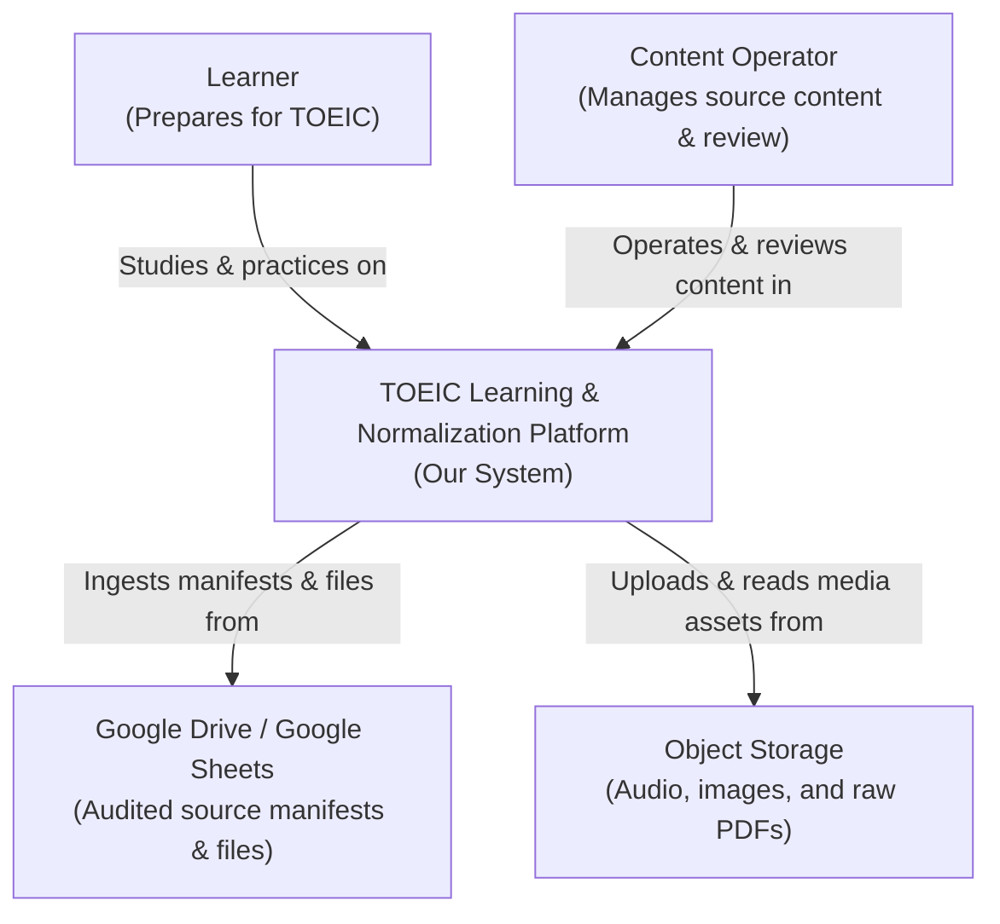
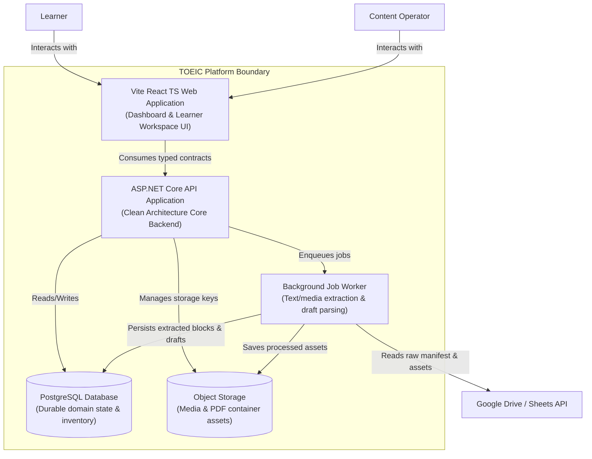

# Technical Architecture

## Architecture Standard

The backend follows Clean Architecture:

```text
Api -> Application -> Domain
Infrastructure -> Application abstractions
Domain has no dependency on Application, Infrastructure, or Api
```

Frontend must consume typed API contracts. It must not contain learner content, unlock logic, scoring logic, or fake production fallback data.

### C4 System Context Diagram



### C4 Container Diagram




## Runtime Components

- React TypeScript web app
- ASP.NET Core API
- Application use-case layer
- Domain model and policies
- PostgreSQL production database
- Object storage for source and media assets
- Background worker for extraction and parsing
- Queue for long-running jobs when needed
- Observability stack for logs, metrics, traces

## Environment Strategy

Local:

- SQLite allowed for fast development tests
- local object storage emulator allowed

Staging:

- PostgreSQL
- object storage
- background worker enabled
- seeded representative content

Production:

- PostgreSQL
- managed object storage
- secret manager
- health checks
- structured logging
- backup and migration strategy

## Boundary Rules

- `ContentFactory` can read source and extraction tables.
- `LearnerJourney` can read only published content and learner state.
- `AttemptReview` can create attempts, review items, and mastery records.
- `Analytics` reads from stable read models or replicas.
- Admin APIs require admin authorization.
- Learner APIs cannot expose admin/source data.

## Legacy Demo Boundary

`DemoLearnerSession` is a legacy demo-only adapter retained temporarily so existing smoke tests can still exercise the current learner route surface while the production journey is built.

The class is explicitly marked obsolete in application code:

- `IsLegacyDemoOnly = true`
- `ReplacementPhase = P4`
- obsolete message: `P0.2 legacy demo-only learner flow. Do not use for production learner APIs.`

The current frontend fallback data is explicitly marked demo-only:

- `LEGACY_DEMO_ONLY_FRONTEND_FALLBACK = true`
- `LEGACY_DEMO_ONLY_REPLACEMENT_PHASE = P7`
- root dataset includes `legacyDemoOnlyFallback` and `legacyDemoOnlyReplacementPhase`

Current legacy endpoints using this adapter:

- `POST /api/learner/demo/reset`
- `GET /api/learner/home`
- `GET /api/learner/activities/{activityId}`
- `POST /api/learner/activities/{activityId}/attempts`
- `GET /api/learner/review`
- `POST /api/learner/review/{reviewItemId}/attempts`

Production rules:

1. New learner endpoints must not inject or call `DemoLearnerSession`.
2. New frontend production screens must not depend on demo-only content returned by these endpoints.
3. Replacement production behavior must be implemented in P4 through persisted learner journey use cases.
4. Replacement production UX must be implemented in P7 through API-driven learner screens.
5. The demo endpoints can be removed only after the P4/P7 production flow has equivalent smoke coverage.
